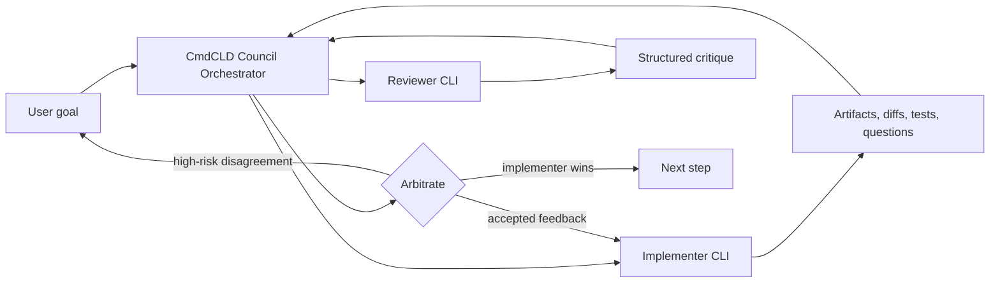

# Autopilot Council Design

**Date:** 2026-05-03  
**Status:** Approved for implementation planning  
**Project:** CmdCLD

## Goal

Add a third Autopilot mode, **Autopilot Council**, where two installed agent CLIs participate in one automated workflow:

- one CLI is chosen by the user as the **Implementer**
- the other CLI is the **Reviewer**
- CmdCLD is the **arbiter**

The Implementer owns all code-writing work. The Reviewer provides structured critique at explicit gates. CmdCLD merges the Reviewer feedback into bounded instructions for the Implementer and keeps the workflow moving.

This mode is intended to get the benefit of two different LLM-backed CLIs without creating a peer-to-peer debate loop or allowing two processes to edit the same project at once.

## Non-goals

- Do not modify Classic Autopilot semantics.
- Do not replace Autopilot PRO.
- Do not allow both CLIs to edit files in the same run.
- Do not create an unbounded debate loop between CLIs.
- Do not make Reviewer approval mandatory for every task in the default mode.
- Do not expose raw Reviewer terminal chatter as the primary user experience.

## Repository Impact

Expected implementation areas:

- `src/main/autopilot-council/`: new Council runtime, prompts, state machine, packets, reviewer session, arbitration, reset helpers.
- `src/main/autopilot-pro/`: reuse patterns for staged artifacts, decision shapes, principles, and artifact approval.
- `src/main/autopilot/`: reuse PTY watching, output inspection, API abstractions, cost tracking, and attach patterns where suitable.
- `src/main/index.ts`: add Council IPC start/control wiring.
- `src/preload/index.ts`: expose Council kickoff/control APIs.
- `src/renderer/src/components/AutopilotKickoff.tsx`: add Council mode controls.
- `src/renderer/src/components/AutopilotPanel.tsx`: surface Council packets, decisions, reviewer warnings, and escalation state.
- `src/renderer/src/types/api.d.ts`: add Council IPC types.
- `src/shared/agent-cli.ts`: reuse provider labels, command building, and CLI model.
- `tests/`: add unit and integration coverage for Council state, packets, arbitration, and UI validation.

## Mode Selection UX

Autopilot kickoff adds a third mode:

```text
Classic | PRO | Council
```

When Council is selected, the kickoff form shows:

- Implementer CLI selector: `Claude` or `Codex`
- Reviewer CLI selector: defaults to the other CLI
- Intensity selector: `Light`, `Balanced`, `Strict`
- Tie-breaker notice: "Implementer wins non-high-risk disagreements."
- Human approval toggles for high-risk situations

The user chooses the Implementer manually. CmdCLD does not auto-pick the Implementer based on project type in the first version.

Recommended default:

```text
Implementer: user's selected default CLI
Reviewer: the other available CLI
Intensity: Balanced
Tie-breaker: Implementer wins low/medium-risk disagreement
```

## Core Architecture

Council mode lives beside the existing runtimes:

```text
src/main/autopilot/
src/main/autopilot-pro/
src/main/autopilot-council/
```

Suggested module layout:

```text
src/main/autopilot-council/
  index.ts
  types.ts
  prompts.ts
  packets.ts
  reviewer-session.ts
  arbitration.ts
  state-machine.ts
  runtime-state.ts
  reset.ts
```

The Implementer is the primary visible terminal. The Reviewer runs as an internal Council participant and is hidden by default. Users see Reviewer output through review packets, decision logs, warnings, and escalation summaries in the Autopilot panel.

The hard runtime invariant:

```text
Only the Implementer may edit files, run mutating commands, stage, or commit.
```

The Reviewer may read provided context, inspect review packets, and return structured recommendations. If the Reviewer attempts to issue mutating instructions or claims to have edited files, CmdCLD treats that response as a protocol violation.

## Workflow



Council uses explicit gates. At each gate, CmdCLD builds a review packet, sends it to the Reviewer, parses the Reviewer verdict, applies arbitration, and either continues, refines, or escalates.

## Persistent Artifacts

Council artifacts live under:

```text
.autopilot-council/
  spec.md
  plan.md
  state.json
  packets/
    001-spec-review.request.md
    001-spec-review.response.json
    002-plan-review.request.md
    002-plan-review.response.json
  decisions.md
  transcript.md
  cost.json
```

Rules:

- `spec.md` and `plan.md` are user-visible artifacts.
- `state.json`, `transcript.md`, and `cost.json` are owned by CmdCLD.
- `packets/` records the exact context sent to the Reviewer and the parsed response.
- `decisions.md` records approvals, refinements, Implementer-wins disagreements, high-risk escalations, and timeout fallbacks.

## Review Packets

CmdCLD sends the Reviewer a packet instead of raw unbounded terminal history.

Packet inputs may include:

- current stage and gate
- user goal
- relevant spec or plan excerpt
- Implementer's latest structured marker
- diff summary or selected patch excerpt
- changed file list
- test/build evidence
- recent decision log entries
- bounded terminal tail

The packet should trim large content deterministically. Large diffs should be summarized by file and include focused hunks around risky changes.

Reviewer prompt contract:

```json
{
  "verdict": "approve | refine | disagree | escalate",
  "risk": "low | medium | high",
  "findings": [
    {
      "title": "short finding",
      "severity": "info | warning | blocking",
      "file": "optional/path",
      "reason": "specific reason",
      "recommended_fix": "specific bounded fix"
    }
  ],
  "recommended_instruction": "one concise instruction for the Implementer",
  "rationale": "short explanation"
}
```

The Reviewer returns JSON only. CmdCLD retries once with a repair prompt if the response is invalid.

## Gates And Intensity

Council supports three intensity levels.

`Light` gates:

- spec review
- plan review
- final review

`Balanced` gates:

- spec review
- plan review
- architecture choice review
- stuck-state review
- phase review
- final review

`Strict` gates:

- every completed task
- all Balanced gates

Default intensity is `Balanced`. `Strict` is intentionally not the default because it increases latency, cost, and review noise.

Architecture choice review triggers when the Implementer emits a shape such as `DECISION_SHAPE: decide-with-rationale`. Stuck-state review triggers before escalating to the user unless the blocker is already clearly human-only.

## Arbitration

CmdCLD is the arbiter. The two CLIs do not negotiate directly.

Arbitration rules:

- Reviewer `approve`: continue.
- Reviewer `refine` with concrete findings: send one bounded instruction to the Implementer.
- Reviewer `refine` with vague findings: retry Reviewer once with stricter instructions.
- Reviewer `disagree` with low or medium risk: Implementer wins; log Reviewer dissent in `decisions.md`.
- Reviewer `disagree` with high risk: pause for user decision.
- Reviewer `escalate`: pause for user decision unless the finding is invalid or out of scope.
- Repeated Reviewer block on the same low/medium-risk issue: Implementer wins after two rounds.
- Repeated Reviewer block on the same high-risk issue: user decides.
- Reviewer timeout on a non-critical gate: log warning and continue with the Implementer.
- Reviewer timeout on spec, plan, or final gate: ask the user or offer to continue without Reviewer input.

High-risk categories:

- security or credential exposure
- data loss
- destructive commands
- irreversible database/schema migration
- dependency license or supply-chain risk
- large architecture commitment
- touching files outside declared boundaries
- Reviewer detecting that tests/build evidence is fabricated or missing for a risky change

The default tie-breaker is:

```text
If there is no consensus and the disagreement is not high-risk, go with the Implementer.
```

## CLI-Specific Rules

If Codex is the Implementer, preserve the existing Codex guardrail:

```text
Codex does not commit locally. The app or human owns staging and commits.
```

If Claude is the Implementer, Council can initially follow existing Claude Autopilot commit behavior. A later setting may make all Council commits app-owned for consistency, but that is not required for the first implementation.

Reviewer rules are the same for both CLIs:

- do not edit files
- do not stage
- do not commit
- do not run destructive or mutating commands
- return structured review output only

## Failure Handling

Reviewer invalid JSON:

- retry once with a repair prompt
- if still invalid on a non-critical gate, log and continue
- if still invalid on spec, plan, or final, escalate or offer continue-without-reviewer

Reviewer protocol violation:

- ignore the response
- log the violation
- retry once if the gate is important
- escalate if repeated on a critical gate

Implementer tries to delegate write ownership to Reviewer:

- reject the request
- restate that Implementer owns all writes
- continue or escalate depending on whether the Implementer can proceed

Both CLIs stuck:

- pause for user
- show current stage, last Implementer marker, last Reviewer verdict, cost, and proposed next options

Cost cap hit:

- pause
- show current spend and the next expected action
- require user approval to continue

## Testing Strategy

Tests should focus on deterministic behavior rather than trying to mock real LLM quality.

Unit tests:

- packet construction and content trimming
- Reviewer response parsing
- invalid JSON repair behavior
- intensity-to-gate selection
- arbitration rules
- Implementer-wins tie-breaker
- high-risk escalation
- repeated block handling
- Council state persistence and resume
- Codex and Claude prompt differences

Integration tests:

- synthetic spec review flow
- synthetic plan review flow
- architecture choice review flow
- stuck gate reviewer consult
- phase review with approve
- phase review with low-risk disagreement where Implementer wins
- final review escalation on high-risk issue

Renderer tests or focused component tests should cover:

- Council mode selection
- Implementer and Reviewer selector validation
- Reviewer defaults to the other CLI
- unavailable CLI warning
- intensity selector behavior
- human approval toggles

## Definition Of Done

- Council mode appears in the Autopilot kickoff UI.
- User can choose Implementer CLI and Reviewer CLI.
- Reviewer defaults to the non-Implementer CLI.
- Council runtime starts the Implementer as the primary visible session.
- Reviewer packets are generated at the configured gates.
- Reviewer responses are parsed, persisted, and visible in the Autopilot panel.
- Arbitration implements the Implementer-wins tie-breaker for non-high-risk disagreement.
- High-risk disagreement pauses for user decision.
- Reviewer timeout and invalid JSON paths are handled.
- Council state resumes after app restart or Autopilot reset.
- Codex-as-Implementer keeps the no-local-commit guardrail.
- Existing Classic and PRO tests continue to pass.
- New tests cover packet construction, gate selection, arbitration, state persistence, and synthetic Council flows.

## Rationale

Council mode is useful only if it improves decisions without destroying momentum. The design therefore makes one CLI the clear owner of implementation, treats the second CLI as a structured reviewer, and lets CmdCLD arbitrate deterministically.

The key product choice is the tie-breaker: when the two CLIs disagree and the issue is not high-risk, the Implementer wins. This prevents the Reviewer from becoming a veto-heavy bottleneck while still preserving a record of dissent for later inspection.
